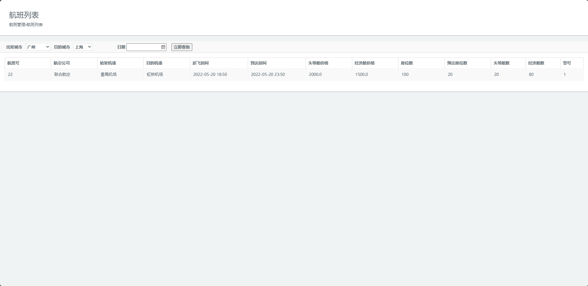
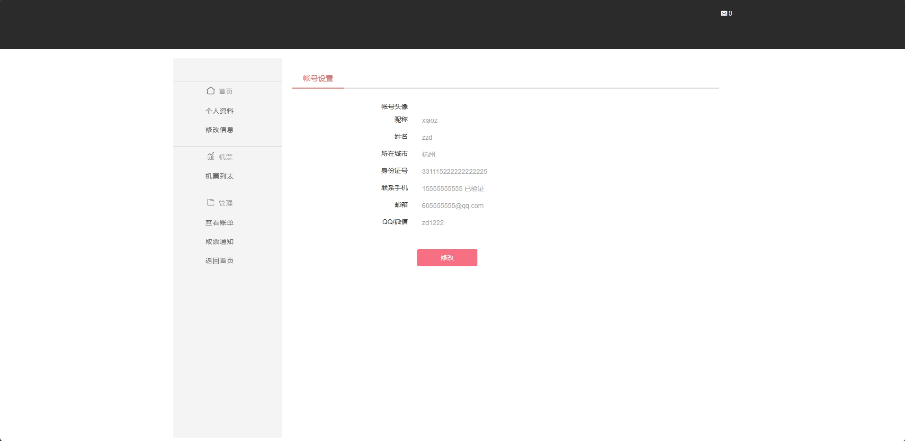
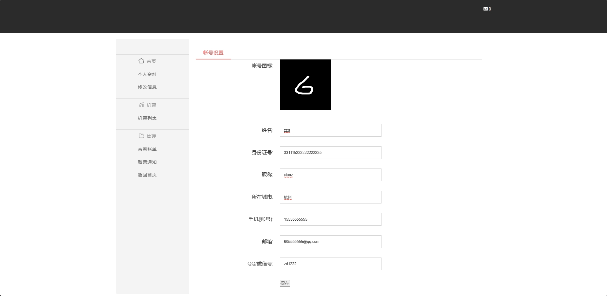
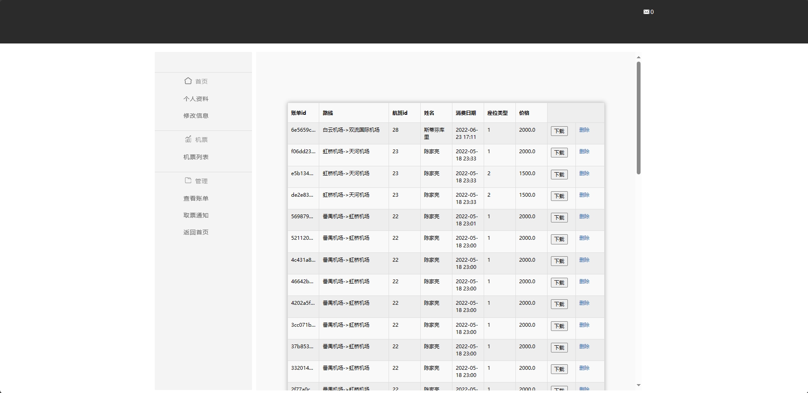
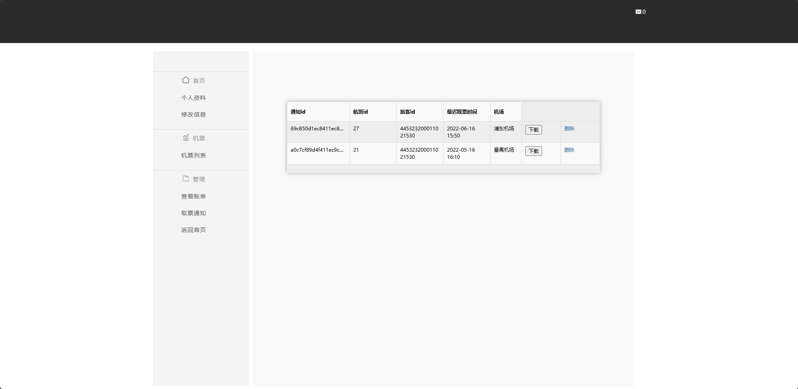
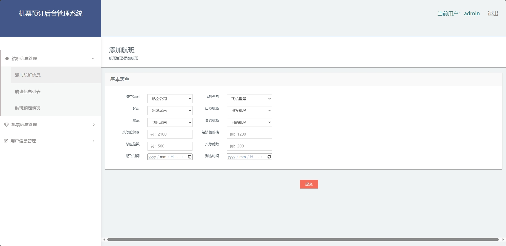

<h1 align="center">基于SSM框架的机票预定系统</h1>

<h4> 完整代码获取地址：从戎源码网（https://armycodes.com/） </h4>
<h4> 作者微信：19941326836 QQ：605739993 QQ群：655392706 </h4>
<h4> 承接计算机毕设、Java毕业设计、Python毕业设计、深度学习、机器学习 </h4>
<h4> 选题+开题报告+任务书+程序定制+安装调试+论文+答辩ppt 一条龙服务 </h4>
<h4> 毕业设计所有选题地址：(https://github.com/Descartes007/allProject) </h4>

## 一、项目介绍

基于SSM框架的机票预定系统：前端 JSP、BootStrap、JQuery、Ajax，后端 SpringBoot、Mybatis，系统角色分为：管理员和旅客，管理员对航班的增删查改，航班数据分析，用户管理，机票管理；旅客注册和登录，航班查询，订票退票，取票通知、账单的查看和打印，个人信息管理。主要功能如下：

### 1、管理员：

- 基本操作：登录
- 航班信息管理：添加航班信息、获取航班信息列表、筛选航班信息、航班统计
- 机票信息管理：获取机票信息列表
- 用户信息管理：获取用户列表、删除用户

### 2、旅客：

- 基本操作：登录、获取个人信息、修改个人信息、图片上传、留言板
- 机票管理：获取机票列表、筛选机票信息
- 账单管理：获取账单列表、下载账单pdf、删除账单、获取取票信息、删除取票信息、下载取票信息pdf

## 二、环境

- <b>IntelliJ IDEA 2020.3</b>

- <b>Mysql 5.7.26</b>

- <b>Maven 3.6.3</b>

- <b>JDK 1.8</b>

## 三、运行截图

